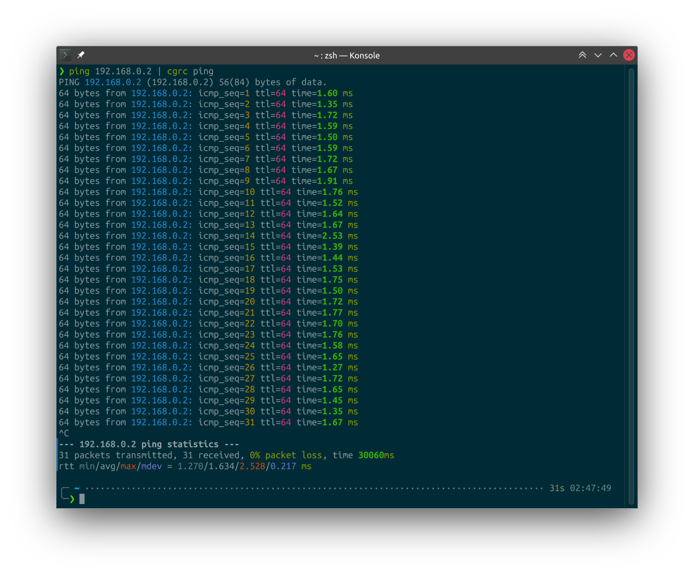
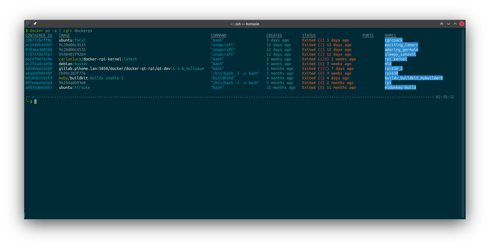

# CGRC - Generic Colorizer

cgrc is a binary that can filter text to improve formatting in a console. It is based on the excellent [grc tool](https://github.com/garabik/grc), it was written in C++ with Qt and then rewritten in Rust. It should be mostly compatible with it, but only a selection of features that I needed were implemented. The reason why cgrc exists is that grc proved to be too slow for me in a few cases, so I quickly implemented a version for myself in C++ and then, just for educational purposes, in Rust. This means that currently only a few configuration files are available, but you can add everything you need. Open a MR if you want to add something to the repo.

## Usage

cgrc should be mostly compatible with grc, so refer to https://github.com/garabik/grc for more info about the configuration file it needs. There are anyway a few changes that I found useful for me. This is the syntax of the command:

```
Configurable terminal text formatter

Usage: cgrc [OPTIONS] <CONF>

Arguments:
  <CONF>  

Options:
      --list-locations       
      --location-user        
      --location-system      
      --list-configurations  
      --conf-path            
      --debug                
  -h, --help                 Print help
  -V, --version              Print version
```

### List locations

cgrc enumerates configuration files from three different locations:

1. embedded configuration directory;
2. user directory;
3. system directory.

The first location searched by cgrc is the binary itself. The binary includes some typical conf files. These files can be used without placing any configuration file on disk. The user directory is a user-specific directory, typically located in the user's home. The system directory is a directory in the filesystem accessible by any user. By using the `--list-locations` options, you can print the exact locations on your system:

```
Locations on your system used by cgrc:
        System location: /etc/cgrc
        User location  : /home/luca/.config/cgrc
```

Locations may change according to the OS you are using or the installation method. Snap packages, for instance, cannot read regular locations under strict confinement.

### List configurations

cgrc can print a summary of all the configurations currently available:

```
Embedded configurations:
        logcat -> parser the android logcat output
        nginx -> formats the default nginx log output
        ping -> formats the output of the ping linux command
        prio -> formats the output of logs containing typical words associated to priorities
        dockerps -> formats the output of docker ps.
        dockerstats -> formatter for docker stats

User configurations:
        /etc/cgrc/dockerpsa -> formats the output of docker ps.

System configurations:
        /home/luca/.config/cgrc/conf.dockerps -> formats the output of docker ps.
```

The description is included in the configuration file.

### Run

cgrc reads from stdin and outputs to stdout. Example:

```
ping 192.168.0.2 | cgrc ping
```

where the second "ping" is the name of the configuration file to use. In this case, ping is a configuration file embedded in the binary.

## Configuration

Refer to the grc readme for writing configuration files. If you wrote conf files for grc, then it is likely it may also work with cgrc. cgrc also reads a "desc" field in the configuration file. This description is reported once the ```--list-configurations``` option is used.

## Installation

At the moment, only cargo installation is implemented.

### Cargo

Snap packages are available for cgrc for architectures amd64, armhf and aarch64. To install:

```cargo install cgrc```

### Build Yourself

```
cd cgrc-rust
cargo run
```

## Examples

<p align="center">
  
  
</p>

## Configurations

There are only a few configurations available at the moment, the ones that I use. You can add your own configurations if you want into local files. If you want to share your configurations, please open a MR.